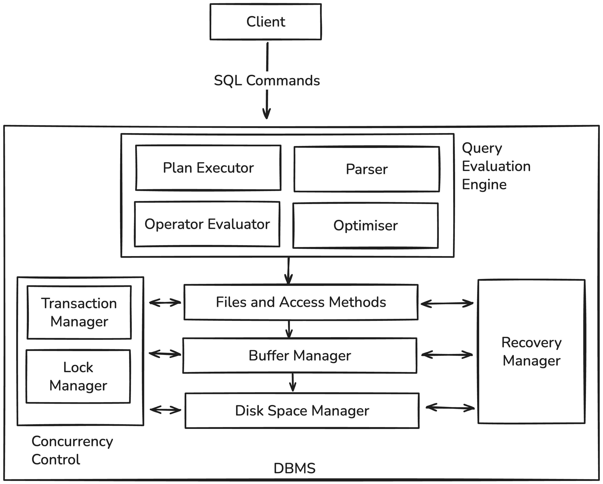

# C++ Relational Database

This repository implements a mini relational database system in modern C++. It is inspired by PostgreSQL and upon taking [CS3223 (Database Implementations)](https://nusmods.com/courses/CS3223/database-systems-implementation).

Technical write-up of this project: [Link](https://mraihan.dev/blog/Implementing-a-relational-database-from-scratch---Storage-Layer)

## Table of Contents

1. [Overview](#overview)
2. [Getting Started](#getting-started)
3. [Build & Test](#build--test)
4. [Project Roadmap](#project-roadmap)

## Overview

This database system is built as a layered architecture, where each layer abstracts a specific level of data management:

1. Storage Layer: Disk Manager, Buffer Manager, Slotted Page Organisation => raw bytes stored as pages (done)
2. Access Layer: Heap Files and Heap iteration => API to access pages stored in heap files (done)
3. Catalog Layer: Creates and provides metadata information for the database (i.e info about tables, attributes, types) (done)
4. Model Layer: Schema aware layer to create and insert rows into user tables in the database (done)
5. Executor Layer: Physical operators (scan, filter, project, limit) using the Volcano iterator model (done)
6. Parser Layer: Lexer, recursive descent parser, and semantic analyzer - SQL string to validated query (partially done, only SELECT query)
7. Planner Layer: Logical and physical planners — converts analyzed queries into executable operator trees (done)
8. Concurrency Control
9. Recoverability Manager

Below is a simplified high-level view of the entire system stack:



## Getting Started

### Prerequisites

- **C++20 or later** (tested with GCC 12+ / Clang 15+)
- **CMake 3.14+**
- **GoogleTest** (fetched automatically via CMake)
- **Make** for simplified build commands

## Build & Test

You can use either CMake directly or the provided Makefile shortcuts.

### Using Makefile

```bash
# Build the project
make build

# Run all tests
make test

# Run DiskManager-specific tests
make test_disk_manager

# Clean build artifacts
make clean
```

### Manual CMake Workflow

```bash
mkdir build && cd build
cmake -DCMAKE_BUILD_TYPE=Debug ..
make -j
ctest --output-on-failure
```

## Storage Layer Overview

The **storage subsystem** forms the foundation of the database.
It is divided into three layers:

| Component         | Description                                     |
| ----------------- | ----------------------------------------------- |
| **DiskManager**   | Handles raw page I/O and file operations.       |
| **BufferManager** | Manages in-memory pages and replacement policy. |
| **Slotted Page**  | Organisation of data within each page.          |

For detailed documentation, see the [storage/README.md](src/storage/README.md).

## Access Layer Overview

The **access subsystem** provides structured access to stored data.
It sits above the storage layer and below query execution.
Currently, only heap access is implemented. (Future work: B+ trees)

| Component        | Description                                           |
| ---------------- | ----------------------------------------------------- |
| **HeapFile**     | Append-only heap storage for variable-length records. |
| **HeapIterator** | Sequential scan over heap file records.               |
| **Record**       | Logical view of a stored tuple.                       |
| **RID**          | Record identifier (page id + slot id).                |

### Responsibilities

- Insert, update, and delete records
- Provide iterator-based access for scans
- Abstract page layout from higher layers

The access layer is restart-safe and operates purely on persisted data.

For detailed documentation, see the [access/README.md](src/access/heap/README.md).

## Catalog Layer Overview

The **catalog subsystem** stores and manages database metadata.
It describes what data exists and where it is stored.

| Component             | Description                                                     |
| --------------------- | --------------------------------------------------------------- |
| **Catalog**           | Entry point for metadata access and bootstrap logic.            |
| **TablesCatalog**     | Stores table-level metadata (table name, heap file, root page). |
| **AttributesCatalog** | Stores column metadata for each table.                          |
| **TypesCatalog**      | Stores built-in and user-defined data types.                    |
| **Catalog Codecs**    | Binary encoders/decoders for catalog rows.                      |

### Responsibilities

- Bootstraps system catalogs on first startup
- Loads catalog metadata from disk on restart
- Provides lookup APIs for tables, columns, and types
- Ensures catalog durability across restarts

Catalog data is persisted using heap files and reconstructed in-memory on startup.

For detailed documentation, see the [catalog/README.md](src/catalog/README.md).

## Database Server Overview

The **database server subsystem** manages database-level lifecycle and routing.
It provides a lightweight entry point for creating, opening, and deleting databases.

| Component    | Description                                       |
| ------------ | ------------------------------------------------- |
| **DbServer** | Manages database files and DiskManager instances. |

### Responsibilities

- Discover existing databases on startup
- Create new database files
- Open existing databases
- Cache active DiskManager instances
- Delete databases safely

For detailed documentation, see the [server/README.md](src/server/README.md).

## Model Layer Overview

The **model layer** acts as the logical bridge between low-level physical storage and high-level database abstractions. It manages how data is structured, aligned in memory, and presented to the system as tables and rows.

| Component        | Description                                                                     |
| ---------------- | ------------------------------------------------------------------------------- |
| **TableManager** | Global registry that caches opened table instances and resolves metadata.       |
| **UserTable**    | Logical handle for a table, enforcing schema and providing a row-based API.     |
| **DynamicCodec** | Serialisation engine that handles binary encoding with proper memory alignment. |
| **Relation**     | Base class providing shared physical interaction logic for all relational data. |

### Responsibilities

- **Metadata Orchestration**: Resolves human-readable table names into physical storage IDs using the Catalog.
- **Schema Enforcement**: Ensures that inserted data matches the types and positions defined in the table schema.
- **Data Alignment**: Automatically handles padding and alignment for various data types during serialization to ensure architecture compatibility.
- **Instance Caching**: Manages a shared cache of active tables to prevent redundant file handles and ensure data consistency.

### Data Representation

The model layer uses a flexible variant-based system to represent in-memory values:
`using Value = std::variant<uint32_t, std::string>;`

When data is persisted, the **DynamicCodec** transforms these variants into a compact, aligned binary format suitable for storage on disk.

For detailed documentation, see the [model/README.md](src/model/README.md).

## Executor Layer Overview

The **executor layer** is responsible for evaluating query plans and producing result tuples. It executes physical operators using the Volcano (iterator) model and serves as the runtime engine that turns logical query intent into actual data flow.

While the model layer focuses on how data is stored and represented, the executor layer focuses on how data is processed.

| Component        | Description                                                              |
| ---------------- | ------------------------------------------------------------------------ |
| **Executor**     | Drives execution of a physical plan by orchestrating operator lifecycle. |
| **Operator**     | Abstract execution node defining the `Open / Next / Close` contract.     |
| **SeqScanOp**    | Leaf operator that scans tuples directly from a relation.                |
| **FilterOp**     | Applies predicates to tuples flowing from its child operator.            |
| **ProjectionOp** | Selects a subset of columns and produces reshaped tuples.                |
| **LimitOp**      | Restricts the number of tuples produced by its child operator.           |

### Responsibilities

- **Plan Execution**: Evaluates a tree of physical operators in a pull-based (iterator) manner.
- **Operator Composition**: Allows operators to be composed like building blocks to form execution pipelines.
- **Tuple-at-a-Time Processing**: Produces results incrementally, enabling short-circuiting and low memory usage.
- **Storage Abstraction**: Ensures higher-level operators remain unaware of storage details by isolating them in leaf operators.

### Operator Model

The executor follows the **Volcano execution model**, where each operator implements:

- `Open()` – initialise internal state
- `Next()` – produce the next tuple (or `nullopt` if exhausted)
- `Close()` – release resources

Operators are divided into two categories:

- **Leaf operators** (e.g. `SeqScanOp`) that read from a `Relation`
- **Non-leaf operators** (e.g. `FilterOp`, `ProjectionOp`, `LimitOp`) that transform tuples produced by child operators

This distinction allows storage access to be tightly controlled while keeping higher-level execution logic composable and reusable.

### Example Execution

Operators are assembled bottom-up to form a physical plan:

```cpp
auto scan = std::make_unique<SeqScanOp>(*students_table);
auto filter = std::make_unique<FilterOp>(
    std::move(scan),
    [](const Tuple& t) {
        return std::get<uint32_t>(t.GetValues()[0]) >= 2;
    }
);
auto project = std::make_unique<ProjectionOp>(std::move(filter), cols, out_schema);

Executor exec{std::move(project)};
auto results = exec.ExecuteAndCollect();
```

Each operator pulls tuples from its child, applies its transformation, and emits results upstream until the plan is exhausted.

For detailed documentation, see the [executor/README.md](src/executor/README.md).

## Parser Layer Overview

The **parser layer** transforms a raw SQL string into a fully validated and type-checked query representation. It follows PostgreSQL's parsing architecture: Lexer -> Parser -> Semantic Analyzer.

| Component    | Description                                                                           |
| ------------ | ------------------------------------------------------------------------------------- |
| **Lexer**    | Tokenises SQL input into keywords, identifiers, literals, operators, and punctuation. |
| **Parser**   | Recursive descent parser that builds a raw AST (`SelectStmt`) from the token stream.  |
| **Analyzer** | Resolves table/column names against the Catalog, checks types, and expands wildcards. |
| **AST**      | Intermediate parse tree with unresolved names (`ColumnRef`, `Literal`, `BinaryExpr`). |
| **Query**    | Final output of analysis — fully resolved with `TableInfo`, `ColumnInfo`, and types.  |

### Responsibilities

- **Lexical Analysis**: Recognises 40 SQL keywords (case-insensitive), string literals with `''` escaping, two-character operators (`<=`, `>=`, `!=`, `<>`), and dot-qualified identifiers.
- **Syntactic Analysis**: Parses `SELECT` statements with target lists (including `*` and aliases), `FROM`, `WHERE`, and `LIMIT` clauses. Implements operator precedence via precedence climbing.
- **Semantic Analysis**: Validates table and column references against the Catalog, enforces type compatibility rules for comparisons and arithmetic, and expands `SELECT *` into individual columns.
- **Error Reporting**: Produces positioned error messages with codes (`SyntaxError`, `ParseError`, `UndefinedTable`, `UndefinedColumn`, `TypeMismatch`).

For detailed documentation, see the [parser/README.md](src/parser/README.md).

## Planner Layer Overview

The **planner layer** converts an analyzed `Query` into an executable operator tree. It is split into two stages: logical planning (what to do) and physical planning (how to do it).

| Component            | Description                                                                        |
| -------------------- | ---------------------------------------------------------------------------------- |
| **LogicalPlanner**   | Builds a tree of logical nodes (Scan, Filter, Project, Limit) from a `Query`.      |
| **PhysicalPlanner**  | Maps logical nodes to physical executor operators (`SeqScanOp`, `FilterOp`, etc.). |
| **CompilePredicate** | Converts `AnalyzedExpr` trees into runtime closures that evaluate against tuples.  |

### Responsibilities

- **Logical Planning**: Constructs a `LogicalScan` -> `LogicalFilter` -> `LogicalProject` -> `LogicalLimit` pipeline from the analyzed query's range table, WHERE clause, target list, and limit.
- **Physical Planning**: Maps each logical node to its corresponding physical operator, resolving column ordinal positions and building output schemas.
- **Predicate Compilation**: Walks the `AnalyzedExpr` tree at plan time and produces a `std::function<bool(Tuple)>` closure for runtime evaluation.

## Project Roadmap

| Phase | Layer           | Status | Description                                                         |
| ----- | --------------- | ------ | ------------------------------------------------------------------- |
| 1     | **Storage**     | Done   | DiskManager, BufferManager, Slotted Pages.                          |
| 2     | **Access**      | Done   | Heap file and heap iteration. (Future: B+-tree, Hash index.)        |
| 3     | **Catalog**     | Done   | System catalogs for tables, columns, and types.                     |
| 4     | **Model**       | Done   | Schema-aware table management with binary encoding.                 |
| 5     | **Executor**    | Done   | Volcano iterator model with scan, filter, project, limit operators. |
| 6     | **Parser**      | Done   | Lexer, recursive descent parser, and semantic analyzer.             |
| 7     | **Planner**     | Done   | Logical and physical planners bridging parser to executor.          |
| 8     | **Concurrency** |        | Locking, transaction management, and isolation.                     |
| 9     | **Recovery**    |        | Write-ahead logging and crash recovery.                             |
| 10    | **Networking**  |        | Client-server interface for remote connections.                     |

## License

This project is released under the [MIT License](LICENSE).
