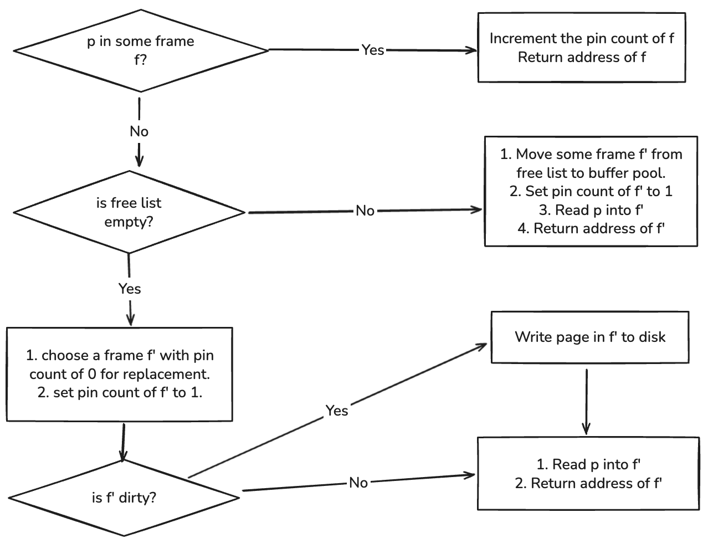

# Buffer Manager

The `BufferManager` is the in-memory caching subsystem responsible for managing database pages between disk storage and the execution layer. It sits above the `DiskManager` and maintains a fixed-size pool of frames to cache disk pages. The buffer manager supports pluggable page-replacement policies via the Strategy Pattern, enabling the system to switch between CLOCK, LRU, LFU, or other policies without modifying the buffer manager itself.

This module consists of the following components:

- `frame.h` – representation of a single in-memory frame holding one page.
- `free_list.h` – manages unused frames available for initial allocation or after eviction.
- `buffer_manager.h` – orchestrates page lookup, pinning, unpinning, loading, eviction, and flushing.
- `IReplacementPolicy` (interface) – abstract strategy interface for replacement algorithms.
- `ClockPolicy` – default implementation of the replacement policy using CLOCK.

`DiskManager` provides raw page I/O operations and is used by the buffer manager to read and write page contents.

## 1. Architecture Overview

At a high level, the buffer manager maintains:

1. A fixed-size array of in-memory frames.
2. A `FreeList` that holds frames that have never been used or have been reclaimed after eviction.
3. A `page_table` mapping from page ID to frame pointer for constant-time lookup.
4. A pluggable replacement policy (via `IReplacementPolicy`) that decides which frame to evict.
5. Pin/unpin semantics to prevent eviction while a page is in active use.
6. Dirty tracking to ensure modified pages are flushed back to disk.

Unlike a basic implementation hard-wired to CLOCK, the buffer manager delegates eviction decisions to an external policy object conforming to the `IReplacementPolicy` interface. This allows different eviction strategies to be used interchangeably.

## 2. Components

### 2.1 Frame (`frame.h`)

A `Frame` represents an in-memory buffer slot containing the content of one page. It is deliberately kept policy-agnostic.

```cpp
struct Frame {
    page_id_t page_id = INVALID_PAGE_ID;
    int pin_count = 0;
    bool dirty = false;
    char* data = nullptr;
};
```

**Frame invariants:**

- `page_id == INVALID_PAGE_ID` means the frame is unused.
- `pin_count > 0` means the frame cannot be evicted.
- `dirty == true` means it must be flushed before reuse.
- Replacement policy metadata is intentionally stored outside the frame so that different algorithms (CLOCK, LRU, LFU) can maintain their own state independently.

### 2.2 FreeList (`free_list.h`)

Tracks frames that are currently unassigned and safe to use for loading new pages.

```cpp
class FreeList {
public:
    void add(Frame* f);
    Frame* get();
    bool empty() const;
    size_t size() const;
};
```

**FreeList Contract:**

- Only frames with `pin_count == 0` and `page_id == INVALID_PAGE_ID` may be added.
- `get()` retrieves an unused frame for loading a new page.
- The free list is used only at initial allocation time and after eviction.
- Releasing a page (via `release()`) does not add the frame to the free list; only eviction does.

### 2.3 Replacement Policy (Strategy Pattern)

The buffer manager uses the Strategy Pattern to delegate eviction behavior to a policy object.

#### 2.3.1 Policy Interface

```cpp
class IReplacementPolicy {
public:
    virtual ~IReplacementPolicy() = default;

    virtual void record_access(Frame* f) = 0;  // page hit
    virtual void record_load(Frame* f) = 0;    // page loaded into a frame
    virtual void record_unpin(Frame* f) = 0;   // unpinned, may become candidate
    virtual Frame* choose_victim(const std::vector<Frame*>& frames) = 0;
};
```

This interface allows policies to maintain whatever tracking data they need (e.g., LRU timestamps, CLOCK bits, LFU counters) without contaminating the `Frame` type.

#### 2.3.2 Example Policy: CLOCK (`clock_policy.h`)

A CLOCK implementation would maintain its own metadata (`ref` bits) in private storage, not in the `Frame`. For example:

```cpp
class ClockPolicy : public IReplacementPolicy {
public:
    ClockPolicy(size_t pool_size) : hand(0), ref_bits(pool_size, false) {}
    ...
};
```

This modular design enables switching to LRU, LFU, or ARC simply by passing a different policy object to the buffer manager.

### 2.4 BufferManager (`buffer_manager.h`)

The buffer manager owns:

- the frame array
- a vector of frame pointers (for the policy)
- the free list
- the page table
- the configured replacement policy
- a reference to the DiskManager

Public interface:

```cpp
class BufferManager {
public:
    BufferManager(std::unique_ptr<IReplacementPolicy> policy, DiskManager* dm);

    Frame* request(page_id_t pid);
    void release(page_id_t pid);
    void mark_dirty(Frame* frame);
    void flush_all();

private:
    Frame* evict();
    void read(page_id_t pid, Frame* f);
    void flush(Frame* f);
    void pin(Frame* f);
    void unpin(Frame* f);

    std::unordered_map<page_id_t, Frame*> page_table_;
    std::vector<Frame> pool_;
    std::vector<Frame*> frame_ptrs_;   // used by replacement policy
    FreeList free_list_;
    std::unique_ptr<IReplacementPolicy> policy_;
    DiskManager* disk_;
};
```

## 3. High-Level Contracts

### 3.1 request(page_id_t pid)

Retrieves a page from the buffer pool, loading it from disk if necessary.



1. **Page Hit**

   - Frame is found in page table.
   - Pin count incremented.
   - Policy is notified (`record_access`).
   - Return the frame.

2. **Free Frame Available**

   - Obtain frame from free list.
   - Load page from disk (`read()`).
   - Insert into page table.
   - Notify policy (`recordLoad`).
   - Pin the frame.

3. **Eviction Required**

   - Policy selects a victim (`chooseVictim`).
   - Victim must have `pin_count == 0`.
   - Dirty victims are flushed.
   - Remove old mapping from page table.
   - Load new page (`read()`).
   - Notify policy (`recordLoad`).
   - Pin the frame.

`request()` always returns a pinned frame.

### 3.2 release(page_id_t pid)

Releases the caller’s use of the page.

- Decrements `pin_count`.
- If `pin_count == 0`, notify policy (`recordUnpin`).
- Frame is not freed or removed from buffer pool.

### 3.3 markDirty(page_id_t pid)

Marks the frame as dirty. The frame will be flushed on eviction or during `flushAll()`.

### 3.4 flushAll()

Writes all dirty pages to disk. Does not modify frame assignment, pin counts, or policy state.

## 4. Interaction with DiskManager

The buffer manager delegates I/O operations to `DiskManager`.

### read(page_id_t pid, Frame\* f)

- Calls `DiskManager::ReadPage(pid, f->data)`
- Assigns `f->page_id = pid`
- Clears dirty flag
- Policy is updated via `recordLoad`

### flush(Frame\* f)

- Calls `DiskManager::WritePage(f->page_id, f->data)`
- Clears dirty flag

All physical storage behavior is contained in the DiskManager.

## 5. Summary

The buffer manager provides:

- Transparent caching of disk pages
- Pin/unpin semantics to protect active frames
- Pluggable replacement policies (Strategy Pattern)
- Safe eviction via policy-driven victim selection
- Persistent integration with DiskManager for I/O
- Support for dirty tracking and flush operations
- Deterministic behavior under limited memory
